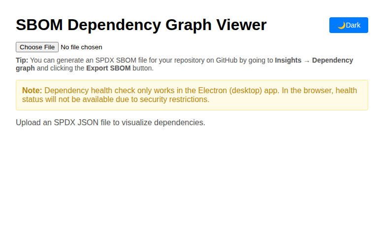

# SBOM Dependency Graph Viewer

👉 **Try the web version here:** [https://danielmeixner.github.io/SBOM-Dependency-Viewer/](https://danielmeixner.github.io/SBOM-Dependency-Viewer/)

A browser and desktop (Electron) app for visualizing and analyzing software dependency graphs from SPDX JSON files. The app provides multiple graph layouts and checks the health of dependencies using OSS Index.

## Features
- **SPDX JSON Upload:** Upload an SPDX JSON file to visualize its dependencies as a graph.
- **Multiple Layouts:** Choose between circular, grid, linear, and tree layouts for the graph.
- **Theme Support:** Switch between light and dark modes for optimal viewing experience.
- **Dependency Health Check:** Each dependency node is colored and annotated based on its health status (healthy, outdated, vulnerable, unmaintained) using OSS Index.
- **Interactive UI:** Hover for tooltips, select layouts, and explore the graph interactively.

## Screenshots

### Light and Dark Mode Support
The application features a clean interface with both light and dark theme support:

**Light Mode:**

**Dark Mode:**

### Dependency Graph Visualization
Once you upload an SPDX JSON file, the application visualizes the dependency graph with multiple layout options:

**Circular Layout (Light Mode):**

**Circular Layout (Dark Mode):**

**Tree Layout (Light Mode):**

**Tree Layout (Dark Mode):**

## Creating an SPDX SBOM File
You can easily generate an SPDX SBOM file for your repository using GitHub's built-in SBOM export feature:

1. Go to your repository on GitHub.
2. Click on the **"Code"** tab.
3. Open the **"Insights"** tab in the top menu.
4. Select **"Dependency graph"** from the sidebar.
5. Click the **"Export SBOM"** button at the top right of the dependency graph page.
6. Download the file in SPDX JSON format and upload it to this app.

This feature is available for most public repositories and for private repositories with GitHub Advanced Security enabled.

## Versions

### Web Version (GitHub Pages)
- **How to run:**
  1. Build the app: `npm run build`
  2. Deploy to GitHub Pages: `npm run deploy`
  3. Or preview locally: `npm run preview`
- **Limitations:**
  - The health check feature (dependency status) does **not** work in the web version due to CORS and API key restrictions. Nodes will show as 'unknown' or 'unavailable' for health status.
  - A comment is shown in the UI to inform users about this limitation.

### Electron Version (Desktop)
- **How to run:**
  1. Build and launch Electron: `npm run electron`
  2. The Electron app will open and allow you to upload SPDX files and view full health check results.
- **Advantages:**
  - The health check feature works fully in Electron, as it can access external APIs without browser CORS restrictions.

## Development
- `npm run dev` — Start the Vite dev server for local development (web only).
- `npm run electron` — Build and launch the Electron app.

## Project Structure
- `src/` — React source code
- `main.js` — Electron main process
- `vite.config.js` — Vite configuration (handles different base paths for web/Electron)
- `.github/workflows/` — GitHub Actions for deployment

## Notes
- For best results, use the Electron version to get full dependency health information.
- The web version is ideal for quick, CORS-free graph exploration, but health status will be limited.

---

MIT License
